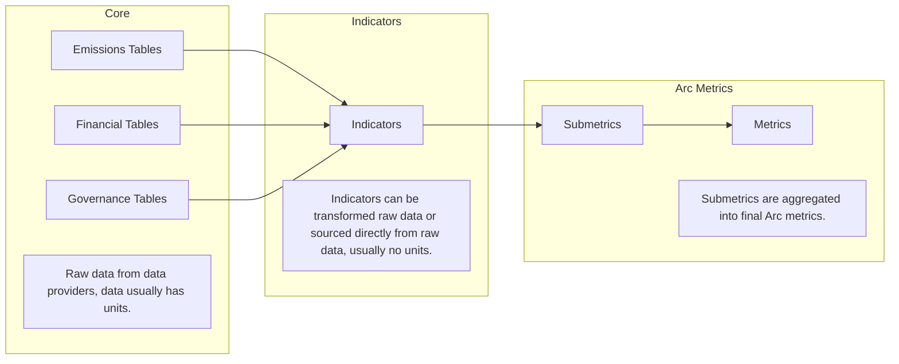

## Summary

Through your Sandbox, you have access to the Arc DATA_EXCHANGE_LAYER schema.
This schema is based on a normalised database but has been enriched with additional columns, making it easier to query by reducing the number of joins needed.

## Data Scoring Flow
High-level description of how raw data is transformed into company scores.

## Data Processing Flow

## Data Model